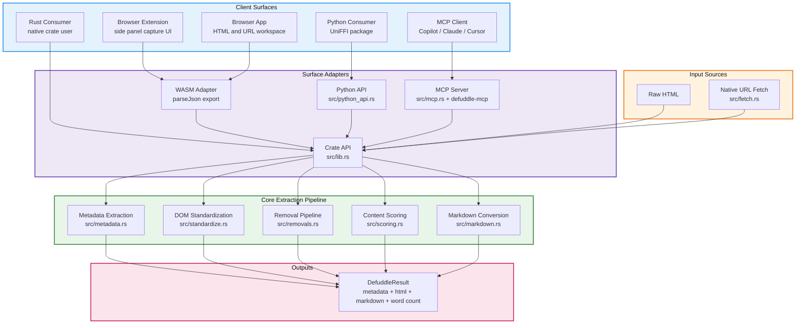

<div align="center">
  <h1>defuddle-rs</h1>
  <p><strong>Web extraction for real software surfaces. Clean article content in, page chrome out.</strong></p>
</div>

[](Cargo.toml)
[](MCP.md)
[](bindings/python/)
[](extension/)
[](PARITY.md)
[](LICENSE)

**Rust + dom_query + reqwest + UniFFI + RMCP + wasm-bindgen**

> Clean-room Rust implementation of [defuddle](https://github.com/kepano/defuddle), packaged for native applications, editor agents, browser capture flows, and Python consumers.

Raw pages are full of chrome. `defuddle-rs` keeps the useful part: extracted metadata, cleaned HTML, cleaned markdown, and a normalized result shape that can be reused across real software surfaces.

It ships the same parser core as:

- a Rust crate
- an MCP server
- a Python package
- a browser extension
- a WASM parser for browser-side UIs

## Overview

Most pages are not mostly content. They are wrappers around content.

Navigation, sidebars, share widgets, footer junk, ad slots, hidden blocks, layout scaffolding, and repeated chrome all make the useful part harder to reuse.

`defuddle-rs` removes that overhead and keeps what downstream tools actually want:

- **Article Body Extraction**: isolate the main readable content node
- **Metadata Extraction**: title, author, date, site, description, image, language
- **Markdown Conversion**: convert cleaned content into portable markdown
- **Native Fetch + Parse**: fetch a URL directly or parse raw HTML
- **MCP Surface**: expose parser operations to local AI tooling over stdio or HTTP
- **Python Surface**: expose the same parser core to scripts and workflows through UniFFI
- **Browser Surface**: capture the active tab into an extension side panel and parse locally
- **WASM Surface**: run the parser in-browser for extension and app UIs

There is no hosted parsing service here. No headless browser. No Node runtime requirement for the core parser.

## Architecture Overview



### Diagram Legend

| Color | Layer | Meaning |
|---|---|---|
| Blue | Client Surfaces | Where people or tools consume the parser |
| Purple | Surface Adapters | Language, transport, and runtime-specific wrappers |
| Green | Core Extraction Pipeline | The Rust parser internals |
| Orange | Input Sources | Raw HTML or native fetch entrypoints |
| Pink | Outputs | Structured extraction result returned to callers |

### Key Components

**Parser Core:**
- **Mutable DOM Pipeline**: uses `dom_query` to parse, mutate, score, and serialize pages
- **Metadata Extraction**: collects page-level metadata before destructive cleanup
- **Removal Pipeline**: exact selectors, partial selectors, hidden elements, and low-signal blocks
- **Main Content Protection**: ancestor guards prevent removal passes from disconnecting the chosen content node
- **Markdown Output**: preserves headings, tables, code blocks, lists, and links in a portable format

**Runtime Surfaces:**
- **Rust API**: direct `parse` and `fetch_and_parse`
- **MCP Server**: parser operations available to local AI clients
- **Python API**: same parser core exported via UniFFI
- **WASM API**: browser-side parsing for extension and app interfaces

**Browser Layer:**
- **Extension Side Panel**: captures the active tab and parses it locally
- **Browser App**: direct HTML and URL parsing interface using the same WASM core

## Extraction Pipeline

The parser follows the same general flow as upstream `defuddle`, but implemented natively in Rust:

1. Parse HTML into a mutable DOM
2. Extract metadata and page-level signals
3. Standardize the document shape
4. Try site-specific extraction paths where available
5. Identify the main content candidate
6. Remove hidden and explicit junk nodes
7. Remove partial-match junk nodes
8. Score remaining blocks for content density
9. Protect main-content ancestors during cleanup
10. Convert the final cleaned content to markdown

That ancestor protection is one of the critical behavioral details. It prevents an over-broad removal selector from deleting the parent chain that still contains the actual article.

## Quick Start

### 1. Rust Crate

```rust
use defuddle_rs::Defuddle;

let html = reqwest::get("https://example.com/article")
    .await?
    .text()
    .await?;

let result = Defuddle::parse(&html, "https://example.com/article")?;

println!("{}", result.title);
println!("{}", result.content_markdown);
println!("{}", result.word_count);
```

Build and test:

```bash
cargo build --release
cargo test
```

### 2. MCP Server

Build:

```bash
cargo build --release --bin defuddle-mcp
```

Run over stdio:

```bash
target/release/defuddle-mcp stdio
```

Run over HTTP:

```bash
target/release/defuddle-mcp http --bind 127.0.0.1:8080 --path /mcp
```

Current tools:

- `parse_html`
- `fetch_and_parse_url`
- `extract_metadata`
- `extract_markdown`

See [MCP.md](MCP.md) for config and transport details.

### 3. Python Bindings

Generate and install the UniFFI package:

```bash
cargo build --release
cargo run --bin uniffi-bindgen -- generate \
  --library target/release/libdefuddle_rs.so \
  --language python \
  --out-dir bindings/python/defuddle
cp target/release/libdefuddle_rs.so bindings/python/defuddle/

uv venv /tmp/defuddle-py-uv
UV_CACHE_DIR=/tmp/uv-cache uv pip install --python /tmp/defuddle-py-uv/bin/python -e bindings/python
```

Smoke test:

```bash
/tmp/defuddle-py-uv/bin/python -c "from pathlib import Path; from defuddle import DefuddleParser; html = Path('tests/fixtures/example.html').read_text(); parser = DefuddleParser(); result = parser.extract_markdown(html, 'https://example.com'); print(result.title); print(result.word_count)"
```

### 4. Browser Extension

Build the WASM bundle and extension assets:

```bash
npm run build:wasm
npm run build:extension
```

Load unpacked from:

```text
extension/
```

Extension-specific details are in [extension/README.md](extension/README.md).

### 5. Browser App

Build the static app:

```bash
npm run build
```

This emits `dist/`.

## API Surface

### Rust

- `Defuddle::parse(html, url)`
- `Defuddle::fetch_and_parse(url)`

### Python

- `DefuddleParser.parse_html(html, url)`
- `DefuddleParser.fetch_and_parse_url(url)`
- `DefuddleParser.extract_metadata(html, url)`
- `DefuddleParser.extract_markdown(html, url)`

### Result Shape

`DefuddleResult` includes:

- `title`
- `author`
- `published`
- `site`
- `description`
- `image`
- `language`
- `content_html`
- `content_markdown`
- `word_count`
- `schema_org`

## Repository Layout

```text
defuddle-rs/
├── src/                    # Rust parser core, MCP server, Python API
├── tests/                  # crate, MCP, HTTPS, and Python integration tests
├── bindings/python/        # UniFFI Python package
├── extension/              # browser extension side panel
├── packages/defuddle-wasm/ # WASM wrapper package
├── app/                    # browser app
├── demo/                   # demo pipeline and assets
├── MCP.md                  # MCP setup and transport docs
├── PARITY.md               # parity notes against upstream fixtures
└── README.md
```

## Parity

This repo includes fixture-based parity validation against upstream `defuddle`, including large and awkward pages like Hacker News threads, MDN docs, Wikipedia, GitHub, and blog content.

See:

- [PARITY.md](PARITY.md)
- [tests/defuddle_test.rs](tests/defuddle_test.rs)

## Clean-Room Note

This is a clean-room Rust implementation. Upstream `defuddle` is used as a behavioral and architectural reference, but the code here is not a direct line-by-line translation of the TypeScript source.
