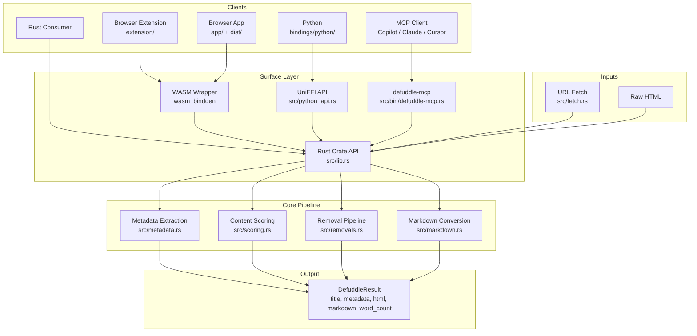

<div align="center">
  <h1>defuddle-rs</h1>
  <p><strong>Web content extraction in Rust. Clean markdown out, noisy page chrome gone.</strong></p>

  [](https://www.rust-lang.org/)
  [](LICENSE)
  [](MCP.md)
  [](bindings/python/)
  [](extension/)
  [](PARITY.md)
</div>

**Tech Stack:** Rust + dom_query + reqwest + UniFFI + RMCP + wasm-bindgen

> Clean-room Rust implementation of [defuddle](https://github.com/kepano/defuddle), exposed as a native crate, MCP server, Python package, browser extension, and WASM parser.

---

## What Is This?

Most pages are mostly chrome: nav, sidebars, ads, footers, boilerplate, share widgets, and layout junk.

`defuddle-rs` keeps the useful part:

- article or post body
- metadata like title, author, published date, site, description, image
- clean HTML
- clean markdown
- word count
- schema.org payloads when present

It does that locally in Rust. No Node runtime. No headless browser. No hosted parsing service.

## Surfaces

This repo ships the same extraction core across multiple surfaces:

- **Rust crate**: direct `parse` and `fetch_and_parse`
- **MCP server**: `parse_html`, `fetch_and_parse_url`, `extract_metadata`, `extract_markdown`
- **Python bindings**: UniFFI package under `bindings/python/`
- **Browser extension**: capture the active tab into a side panel UI
- **WASM parser**: local browser-side parsing for the extension and web app

## Architecture Overview



### Legend

- **Clients**: where the parser is consumed
- **Surface Layer**: transport or language bindings around the core crate
- **Core Pipeline**: extraction stages inside Rust
- **Inputs**: either raw HTML or native URL fetch
- **Output**: a normalized `DefuddleResult`

## Extraction Pipeline

The implementation follows the same broad shape as upstream `defuddle`:

1. Parse HTML into a mutable DOM
2. Extract metadata first
3. Try any site-specific extraction path
4. Locate the main content element
5. Remove hidden elements
6. Remove exact-selector junk
7. Remove partial-selector junk
8. Score and strip low-content blocks
9. Avoid deleting ancestors of the chosen main content node
10. Convert the cleaned result to markdown

That ancestor protection is critical. It prevents removal passes from disconnecting the actual article body.

## Quick Start

### Rust

```rust
use defuddle_rs::Defuddle;

let html = reqwest::get("https://example.com/article").await?.text().await?;
let result = Defuddle::parse(&html, "https://example.com/article")?;

println!("{}", result.title);
println!("{}", result.content_markdown);
println!("{}", result.word_count);
```

### Build

```bash
cargo build --release
cargo test
```

### MCP

```bash
cargo build --release --bin defuddle-mcp
target/release/defuddle-mcp stdio
```

HTTP mode:

```bash
target/release/defuddle-mcp http --bind 127.0.0.1:8080 --path /mcp
```

See [MCP.md](MCP.md) for transport details and config examples.

### Python

```bash
cargo build --release
cargo run --bin uniffi-bindgen -- generate \
  --library target/release/libdefuddle_rs.so \
  --language python \
  --out-dir bindings/python/defuddle
cp target/release/libdefuddle_rs.so bindings/python/defuddle/

uv venv /tmp/defuddle-py-uv
UV_CACHE_DIR=/tmp/uv-cache uv pip install --python /tmp/defuddle-py-uv/bin/python -e bindings/python
```

Smoke test:

```bash
/tmp/defuddle-py-uv/bin/python -c "from pathlib import Path; from defuddle import DefuddleParser; html = Path('tests/fixtures/example.html').read_text(); parser = DefuddleParser(); result = parser.extract_markdown(html, 'https://example.com'); print(result.title); print(result.word_count)"
```

### Browser Extension

Build the WASM bundle and extension assets:

```bash
npm run build:wasm
npm run build:extension
```

Load the unpacked extension from:

```text
extension/
```

Extension-specific usage is documented in [extension/README.md](extension/README.md).

## MCP Tools

Current parser-facing MCP tools:

- `parse_html`
- `fetch_and_parse_url`
- `extract_metadata`
- `extract_markdown`

## API Surface

### Rust

- `Defuddle::parse(html, url)`
- `Defuddle::fetch_and_parse(url)`

### Python

- `DefuddleParser.parse_html(html, url)`
- `DefuddleParser.fetch_and_parse_url(url)`
- `DefuddleParser.extract_metadata(html, url)`
- `DefuddleParser.extract_markdown(html, url)`

## Result Shape

`DefuddleResult` includes:

- `title`
- `author`
- `published`
- `site`
- `description`
- `image`
- `language`
- `content_html`
- `content_markdown`
- `word_count`
- `schema_org`

## Parity

The repo includes fixture-based parity validation against upstream `defuddle`, including larger pages like Hacker News, MDN, Wikipedia, and GitHub.

See:

- [PARITY.md](PARITY.md)
- [tests/defuddle_test.rs](tests/defuddle_test.rs)

## Repository Layout

```text
defuddle-rs/
├── src/                 # Rust extraction core, MCP server, Python API
├── tests/               # crate + MCP + Python integration tests
├── bindings/python/     # UniFFI Python package
├── extension/           # browser extension side panel UI
├── packages/defuddle-wasm/  # WASM package wrapper
├── app/                 # browser app
├── demo/                # demo pipeline and assets
├── MCP.md               # MCP usage and config
└── PARITY.md            # fixture parity notes
```

## Clean-Room Note

This is a clean-room Rust implementation. The upstream TypeScript project is used as a behavioral reference, not as a direct line-by-line translation.
